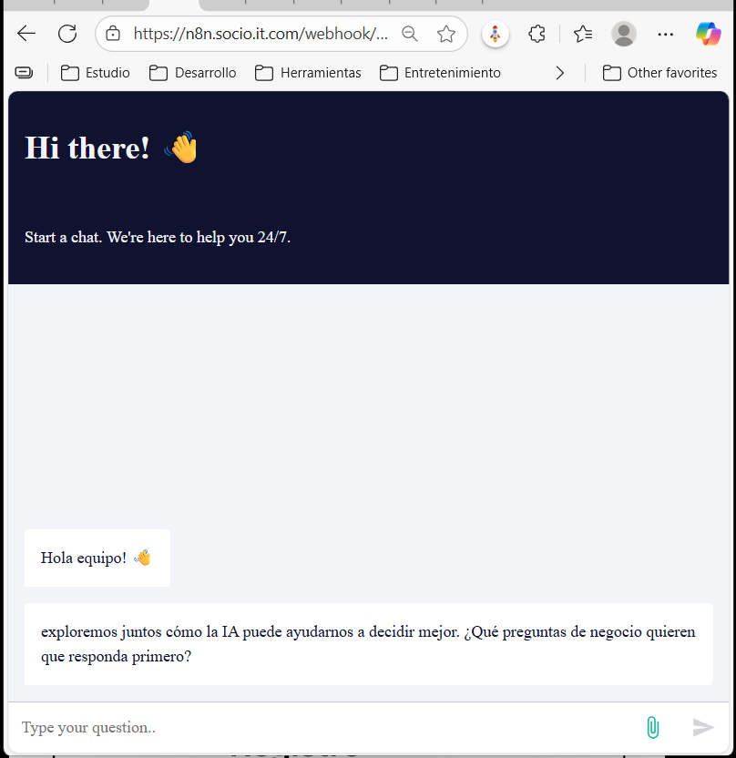

# Caso Técnico: Sistema de Análisis Inteligente para Operaciones Rappi

Sistema de análisis automatizado que conecta flujos n8n con un MCP (Model Control Point) para procesar consultas, análisis y coordinación inteligente de datos operativos en Rappi.

---

## 🎥 Demo
- **Captura del chat (stack)**: `/demo/chat.png`
- **Arquitectura**: `cliente → n8n → MCP → serve → PostgreSQL`
- **Stack visual:** LangGraph para flujos internos y coordinación de agentes.
---

## ⚙️ Stack Técnico
| Componente | Descripción |
|-------------|-------------|
| **Frontend** | n8n (interfaz y orquestador visual) |
| **Backend / Core** | FastMCP (servidor Python con LangGraph) |
| **DB** | PostgreSQL |
| **Infraestructura** | Docker + UV (entorno reproducible) |
| **Flujo SSE** | n8n ↔ MCP (comunicación en tiempo real) |

---

## 🧱 Arquitectura General

El sistema está dividido en tres capas principales, comunicadas mediante protocolos SSE y APIs REST.  
La interacción sigue el flujo **Cliente → n8n → MCP → LangGraph → PostgreSQL**.

---

### 1️⃣ Frontend e Interfaz Conversacional (n8n)


- **Componente:** flujo *Rappi Multiagent Data Insights*.
- **Función:** interfaz de chat embebida en web (n8n webhook).
- **Flujo:**
  - El usuario inicia conversación vía chat web.
  - Un *Text Classifier* detecta si el mensaje requiere un **informe automático** o una **respuesta analítica directa**.
  - Si es un informe, redirige al flujo **Rappi Multiagent Report**.
  - Si no, continúa el flujo normal con el agente MCP y la base de memoria.

---

### 2️⃣ Procesamiento de Datos y Memoria (n8n + LangGraph + MCP)


- **Subflujos principales:**
  - **RAG:** permite subir documentos (PDF, CSV) y genera *embeddings* para ampliar contexto.
  - **CORE:** coordina los agentes `RAG` y `MCP` dentro de un pipeline de análisis.
  - **Postgres Chat Memory:** almacena el historial de conversaciones en la base de datos para mantener continuidad.

**Componentes Clave**
| Módulo | Descripción |
|--------|--------------|
| `RAG` | Carga documentos, crea embeddings y expande contexto. |
| `AI Agent RAG` | Analiza contexto extendido con datos recientes. |
| `AI Agent MCP` | Coordina el flujo hacia LangGraph y la base. |
| `Postgres Memory` | Persistencia de memoria conversacional. |

---

### 3️⃣ MCP Server y LangGraph Multiagente


El **MCP Server** orquesta la ejecución de un **LangGraph multiagente** que contiene agentes especializados para distintos tipos de análisis.

| Agente | Rol |
|---------|-----|
| `curador_de_metricas` | Filtra y normaliza métricas relevantes. |
| `comparador` | Analiza diferencias entre períodos o segmentos. |
| `cronista_temporal` | Identifica tendencias y evoluciones. |
| `orquestador_de_agregacion` | Agrupa y resume información estadística. |
| `trade_offs` | Detecta compromisos entre variables. |

> Todos los agentes están compuestos dentro del MCP (no hay herencia), lo que permite una ejecución flexible y escalable.

---

### 4️⃣ Flujo de LangGraph (procesamiento SQL e inferencia)


**Etapas del grafo:**
1. `ingest`: entrada del mensaje del usuario.
2. `agent_coordinator`: delega según el tipo de tarea.
3. `ambiguity_detector`: analiza claridad de la pregunta.
4. `clarification_handler`: solicita aclaraciones si es necesario.
5. `table_validator`: verifica estructura de base de datos.
6. `sql_agent`: genera consultas SQL automáticas.
7. `sql_process` / `multi_query_processor`: ejecutan consultas simples o múltiples.
8. `sql_evaluator`: evalúa resultados, controla reintentos.
9. `data_analyst`: produce el análisis final.

---

### 5️⃣ Generación Automática de Reportes


Este flujo se activa automáticamente cuando el *clasificador* detecta intención de reporte.

**Proceso:**
1. Se ejecutan los agentes especializados (`curador`, `comparador`, `cronista`, `orquestador`, `trade_offs`).
2. Los resultados son combinados por un nodo *Merge*.
3. El **Generador de Informe** sintetiza el reporte final.
4. Se envía automáticamente por correo al usuario.

---

### 🔄 Flujo resumido

```plaintext
Usuario
  ↓
n8n Chat (Webhook)
  ↓
Clasificador (elige entre análisis o informe)
  ↓
→ Si análisis: LangGraph (multiagente SQL + contexto)
→ Si informe: Multiagent Report (curador, comparador, cronista, etc.)
  ↓
MCP Server (coordina ambos)
  ↓
PostgreSQL (persistencia)
  ↓
Respuesta o Reporte → n8n → Usuario


---
## ⚙️ Instalación y Ejecución

El sistema puede ejecutarse de dos formas:  
1. **Modo local (desarrollo rápido con UV)**  
2. **Modo contenedorizado (Docker Compose)**

---

### 🧩 1️⃣ Modo local — desarrollo con UV

Este modo es ideal para depurar o probar el MCP sin levantar toda la infraestructura.

```bash
# Clona el repositorio
git clone https://github.com/<tu_usuario>/rappi-multiagent.git
cd rappi-multiagent

# Inicializa el entorno UV
uv init

# Instala dependencias (usa pyproject.toml)
uv sync

# Inicia el servidor FastMCP local
uv run fastmcp serve --port 8000

### 🐳 2️⃣ Modo producción — stack completo con Docker Compose

En este modo se levanta **todo el sistema completo** (FastMCP + PostgreSQL) dentro de contenedores, replicando el entorno de despliegue real.

#### 🚀 Levantar el entorno

```bash
docker compose up --build


